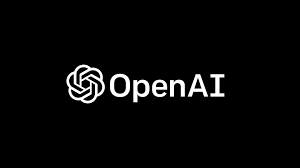
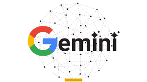
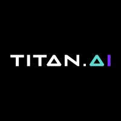

In the rapidly evolving world of artificial intelligence, several prominent players are pushing the boundaries of what AI can achieve. This comparison explores four major AI systems: OpenAI's GPT models, Gemini AI, Titan AI, and Twitter AI. We’ll delve into their core functionalities, applications, and unique features to help you understand how they stack up against each other.

## 1. **OpenAI's GPT Models**

### 1.1 **Overview**

OpenAI's Generative Pre-trained Transformers (GPT) are among the most advanced language models available. GPT models are known for their natural language understanding and generation capabilities.

### 1.2 **Core Features**

- **Natural Language Understanding**: Handles complex queries with context-aware responses.
- **Text Generation**: Creates coherent and contextually relevant text.
- **Applications**: Chatbots, content creation, language translation, and more.

### 1.3 **Strengths**

- **State-of-the-Art Performance**: Consistently at the forefront of NLP benchmarks.
- **Versatile**: Supports a wide range of applications.
- **OpenAI Playground**: Easy to experiment with models in a user-friendly interface.

### 1.4 **Weaknesses**

- **Computational Resources**: High computational costs for training and inference.
- **Ethical Concerns**: Issues related to bias and misinformation.

### 1.5 **Further Reading**

- [OpenAI's GPT-4 Paper](https://www.openai.com/research/gpt-4)
- [Exploring GPT-3](https://towardsdatascience.com/a-comprehensive-guide-to-gpt-3-3f3e9b0f14e5)

## 2. **Gemini AI**

### 2.1 **Overview**

Gemini AI, developed by Google DeepMind, aims to combine the strengths of language understanding with advanced reasoning capabilities.

### 2.2 **Core Features**

- **Contextual Reasoning**: Advanced ability to handle nuanced and complex queries.
- **Integration**: Designed to integrate with Google's suite of tools and services.
- **Applications**: Enhanced search capabilities, virtual assistants, and enterprise solutions.

### 2.3 **Strengths**

- **Deep Integration**: Seamlessly integrates with Google services.
- **Advanced Reasoning**: Improved handling of complex queries and reasoning tasks.
- **Scalability**: Built to handle large-scale applications efficiently.

### 2.4 **Weaknesses**

- **Limited Public Access**: Less available for public experimentation compared to OpenAI’s models.
- **Data Privacy Concerns**: Potential issues with data security and privacy.

### 2.5 **Further Reading**

- [DeepMind’s Gemini AI](https://deepmind.com/research/case-studies/gemini-ai)
- [Introduction to Gemini AI](https://www.analyticsinsight.net/gemini-ai-googles-new-leap-into-artificial-intelligence/)

## 3. **Titan AI**

### 3.1 **Overview**

Titan AI, developed by Amazon Web Services (AWS), focuses on delivering AI solutions optimized for large-scale enterprise applications.

### 3.2 **Core Features**

- **Scalability**: Designed for large-scale data processing and deployment.
- **Integration with AWS**: Tight integration with AWS ecosystem for seamless cloud-based AI solutions.
- **Applications**: Business intelligence, predictive analytics, and customer insights.

### 3.3 **Strengths**

- **Enterprise-Grade**: Built for high-performance and scalability in business environments.
- **AWS Ecosystem**: Benefits from AWS’s extensive cloud infrastructure and services.
- **Customizable**: Offers various tools for customization and integration.

### 3.4 **Weaknesses**

- **Complexity**: May require a steep learning curve for new users.
- **Cost**: Can be expensive for smaller projects or businesses.

### 3.5 **Further Reading**

- [AWS Titan AI Overview](https://aws.amazon.com/machine-learning/titan/)
- [Exploring AWS AI Solutions](https://aws.amazon.com/machine-learning/)

## 4. **Twitter AI**

### 4.1 **Overview**

Twitter’s AI initiatives focus on enhancing the platform’s user experience, moderation, and content recommendation.

### 4.2 **Core Features**

- **Content Moderation**: Uses AI for detecting and managing harmful content.
- **Recommendation Systems**: Personalizes user feeds and suggestions.
- **Real-Time Analysis**: Analyzes tweets and trends in real-time.

### 4.3 **Strengths**

- **Platform-Specific**: Tailored to the unique needs of social media and real-time data.
- **User Engagement**: Enhances user experience through personalized recommendations.
- **Scalability**: Designed to handle vast amounts of user-generated content.

### 4.4 **Weaknesses**

- **Transparency**: Limited transparency regarding AI models and their decision-making processes.
- **Bias**: Potential issues with algorithmic bias and content moderation.

### 4.5 **Further Reading**

- [Twitter AI Blog](https://blog.twitter.com/engineering/en_us/topics/ai)
- [Understanding Twitter’s Content Moderation](https://www.theverge.com/2020/11/30/21720770/twitter-content-moderation-ai-machine-learning-transparency)

Feel free to explore the resources and links provided to gain deeper insights into each AI system. Happy exploring!

---
