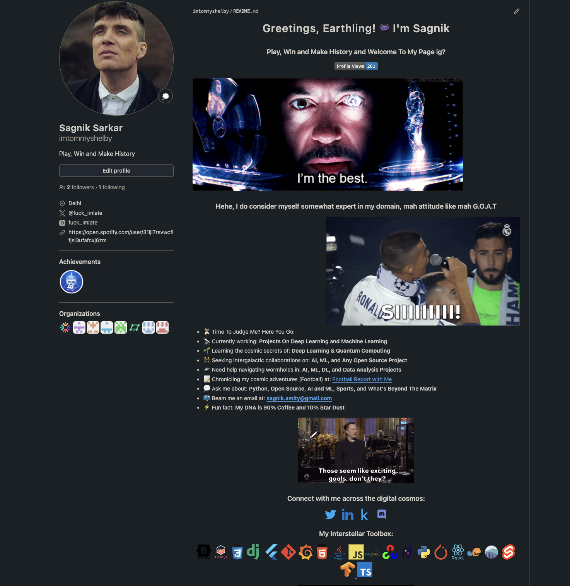

Here’s a guide on creating your own GitHub README page, formatted in Markdown. 

---

# How to Create Your Own GitHub README Page

A well-crafted README page can make your GitHub repository stand out. It provides important information about your project and helps other users understand its purpose and how to use it. This guide will walk you through the process of creating a GitHub README page.

## 1. **Creating a README.md File**

### 1.1 **Initialize Your Repository**

If you haven’t already created a GitHub repository, follow these steps:

1. Go to [GitHub](https://github.com/) and log in.
2. Click on the `+` icon in the top right corner and select "New repository."
3. Name your repository and click "Create repository."

### 1.2 **Create a README.md File**

You can create a README file directly on GitHub or locally on your machine.

#### On GitHub

1. Navigate to your repository on GitHub.
2. Click on "Add file" and select "Create new file."
3. Name the file `README.md` and add your content.

#### Locally

1. Clone your repository to your local machine:

    ```sh
    git clone https://github.com/yourusername/your-repository.git
    ```

2. Navigate to the repository directory:

    ```sh
    cd your-repository
    ```

3. Create a `README.md` file using a text editor:

    ```sh
    touch README.md
    ```

4. Open `README.md` and start editing it.

## 2. **Writing Your README**

Here’s a basic structure for your README file:

```markdown
# Project Title

A brief description of what this project does and who it's for.


## Features

- List of features or functionalities.
- Highlight key points or unique selling propositions.

## Installation

### Prerequisites

List any prerequisites and installation steps. For example:

```sh
# Install Python
brew install python
```

### Steps

1. Clone the repository:

    ```sh
    git clone https://github.com/yourusername/your-repository.git
    ```

2. Navigate to the project directory:

    ```sh
    cd your-repository
    ```

3. Install dependencies:

    ```sh
    pip install -r requirements.txt
    ```

## Usage

Provide examples and code snippets demonstrating how to use your project:

```python
import your_module

result = your_module.function()
print(result)
```

## Contributing

Explain how others can contribute to your project. For example:

1. Fork the repository.
2. Create a new branch (`git checkout -b feature-branch`).
3. Make changes and commit them (`git commit -am 'Add new feature'`).
4. Push to the branch (`git push origin feature-branch`).
5. Create a new Pull Request.

## License

Include information about the project's license:

This project is licensed under the MIT License - see the [LICENSE](https://docs.github.com/en/repositories/managing-your-repositorys-settings-and-features/customizing-your-repository/licensing-a-repository) file for details.

## Contact

Provide your contact information or a way for users to reach out:

- **Email:** [your mail](sagnik.amity@gmail.com)
- **LinkedIn:** [Your LinkedIn](https://www.linkedin.com/in/sagnik-sarkar-710/)
- **Twitter:** [@yourhandle](https://x.com/fuck_imlate)

```

## 3. **Formatting Tips**

### Markdown Syntax

- **Headings**: `#`, `##`, `###`
- **Bold**: `**text**`
- **Italic**: `*text*`
- **Code**: `` `code` ``
- **Code Blocks**: 

    ```markdown
    ```python
    print("Hello, world!")
    ```
    ```

### Images

Add images using:

```markdown

```

### Links

Add links using:

```markdown
[Link text](https://yourlink.com)
```

## 4. **Useful Resources**

### YouTube Tutorials

- [How to Write a README for Your GitHub Project](https://www.youtube.com/watch?v=2tH5K8VZLsA)
- [Markdown for GitHub](https://www.youtube.com/watch?v=H0F6b8bSyYo)
- [Creating a GitHub README](https://www.youtube.com/watch?v=FZGh-J-4F5g)

### GitHub Repositories

- [GitHub README Templates](https://github.com/othneildrew/Best-README-Template)
- [Awesome README](https://github.com/matiassingers/awesome-readme)

## 5. **Demo**

Here’s an example of a well-structured README page:



You can check out the [example repository](https://github.com/imtommyshelby) to see how it looks.

---

Feel free to customize your README to fit the needs of your project and showcase your work effectively. Happy coding!

