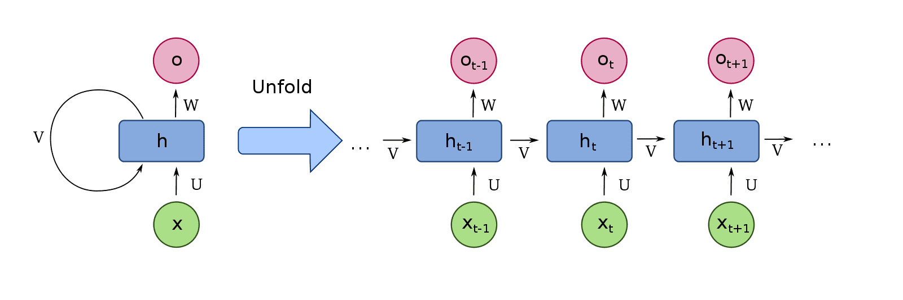
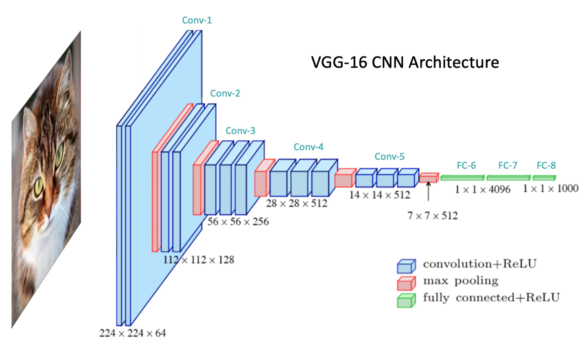
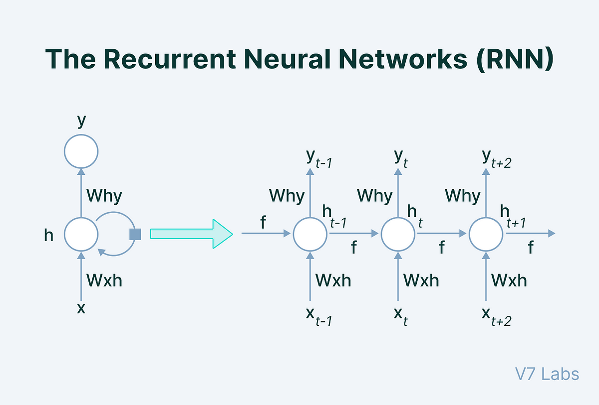
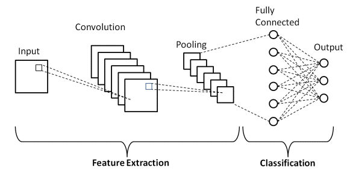
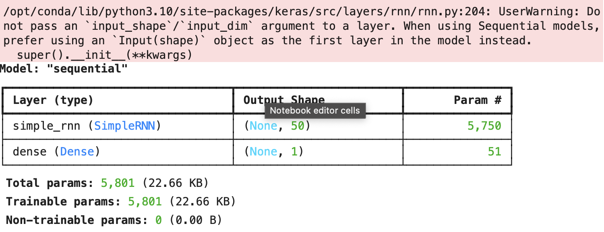
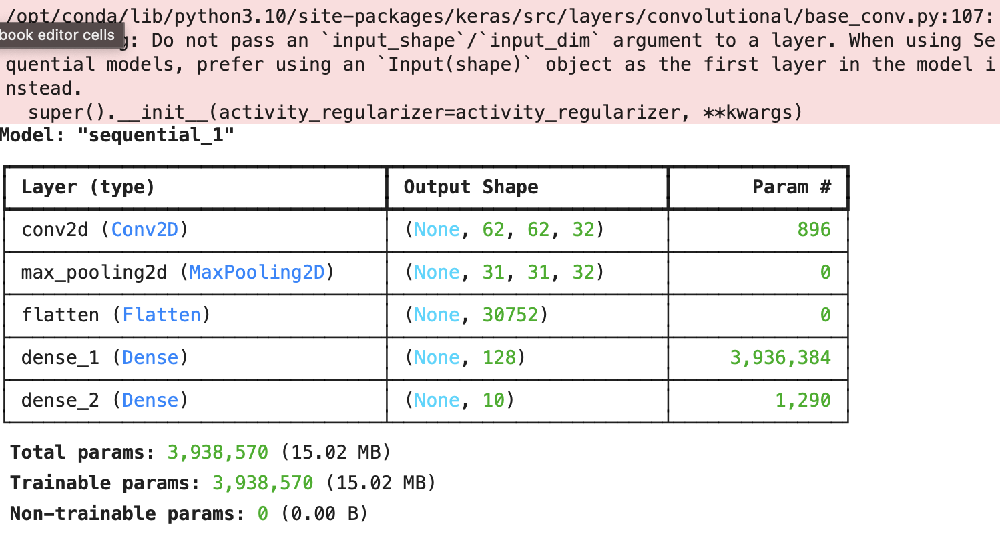

When working with deep learning models, Recurrent Neural Networks (RNNs) and Convolutional Neural Networks (CNNs) are two essential architectures. Both serve distinct purposes and are used for different types of tasks. This guide will delve into their differences, including their applications, advantages, and use cases.

## 1. **Overview**

### 1.1 **Recurrent Neural Networks (RNNs)**

RNNs are designed to handle sequential data. They are particularly useful for tasks where the order of the data points is significant, such as time series prediction or natural language processing.



### 1.2 **Convolutional Neural Networks (CNNs)**

CNNs are specialized for processing grid-like data, such as images. They use convolutional layers to detect features and patterns in the data, making them highly effective for image recognition and classification tasks.



## 2. **Key Differences**

### 2.1 **Architecture**

- **RNN**:
  - **Sequential Data**: Processes data in a sequence, maintaining hidden states across time steps.
  - **Feedback Loops**: Contains connections that loop back to previous layers, enabling the network to maintain information over time.



- **CNN**:
  - **Grid-like Data**: Applies convolutional filters to the entire image, capturing spatial hierarchies.
  - **Layers**: Composed of convolutional layers, pooling layers, and fully connected layers.

  

### 2.2 **Applications**

- **RNN**:
  - **Natural Language Processing**: Text generation, machine translation.
  - **Time Series Prediction**: Stock prices, weather forecasting.
  - **Speech Recognition**: Converting spoken language into text.


- **CNN**:
  - **Image Recognition**: Identifying objects in images.
  - **Image Classification**: Categorizing images into predefined classes.
  - **Object Detection**: Detecting objects and their locations within an image.


### 2.3 **Data Handling**

- **RNN**:
  - **Temporal Dependencies**: Excellent for learning patterns over time and sequences.
  - **Vanishing Gradient Problem**: Can suffer from vanishing gradients, making it hard to learn long-term dependencies.


- **CNN**:
  - **Spatial Hierarchies**: Captures spatial features like edges, textures, and patterns.
  - **Parameter Sharing**: Uses shared weights in convolutional filters, reducing the number of parameters.


## 3. **Code Demos**

### 3.1 **RNN Example (TensorFlow/Keras)**

```python
import tensorflow as tf
from tensorflow.keras.models import Sequential
from tensorflow.keras.layers import SimpleRNN, Dense

model = Sequential([
    SimpleRNN(50, input_shape=(10, 64)),  # 10 time steps, 64 features
    Dense(1)
])

model.compile(optimizer='adam', loss='mse')
model.summary()
```



### 3.2 **CNN Example (TensorFlow/Keras)**

```python
import tensorflow as tf
from tensorflow.keras.models import Sequential
from tensorflow.keras.layers import Conv2D, MaxPooling2D, Flatten, Dense

model = Sequential([
    Conv2D(32, (3, 3), activation='relu', input_shape=(64, 64, 3)),
    MaxPooling2D(pool_size=(2, 2)),
    Flatten(),
    Dense(128, activation='relu'),
    Dense(10, activation='softmax')
])

model.compile(optimizer='adam', loss='sparse_categorical_crossentropy', metrics=['accuracy'])
model.summary()
```



## 4. **Further Learning**

### 4.1 **YouTube Tutorials**

- [Understanding RNNs: A Beginner’s Guide](https://www.youtube.com/watch?v=6cK7V0k5Grk)
- [CNNs Explained: How Convolutional Neural Networks Work](https://www.youtube.com/watch?v=2-Ol7ZB0MmU)


### 4.2 **GitHub Repositories**

- [RNN Examples](https://github.com/keras-team/keras/blob/v2.13.0/examples/keras_recipes/rnn_tutorial.py)
- [CNN Examples](https://github.com/keras-team/keras/blob/v2.13.0/examples/keras_recipes/cnn_tutorial.py)


### 4.3 **Articles and Guides**

- [Introduction to RNNs](https://towardsdatascience.com/understanding-rnn-and-lstm-cd74d2a37a65)
- [CNNs: The Power of Convolutional Neural Networks](https://towardsdatascience.com/convolutional-neural-networks-cnn-the-introduction-and-theory-57e7b09d2c89)


## 5. **Conclusion**

RNNs and CNNs are powerful neural network architectures designed for different types of tasks. RNNs excel at handling sequential data with temporal dependencies, while CNNs are optimized for processing grid-like data, such as images. Understanding their differences and applications can help you choose the right model for your specific problem.

---

