The Command Line Interface (CLI) is a powerful tool for interacting with your computer's operating system. Understanding CLI basics can significantly enhance your productivity, especially as a developer. Here's a guide to get you started with the CLI, including common commands, usage examples, and resources for further learning.

## 1. **What is CLI?**

The Command Line Interface (CLI) allows you to interact with your computer using text-based commands. It provides a more direct and often faster way to perform tasks compared to graphical user interfaces (GUIs).

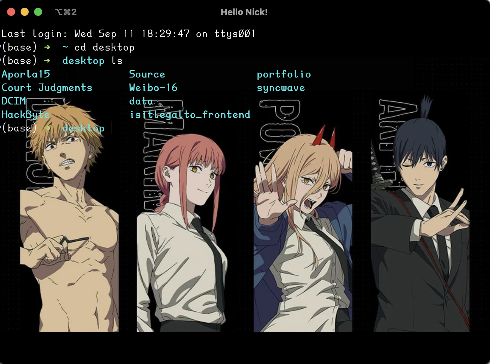

## 2. **Basic Commands**

### 2.1 **Navigating the File System**

- **`pwd`**: Print Working Directory
  ```bash
  $ pwd
  /Users/username/Documents
  ```
  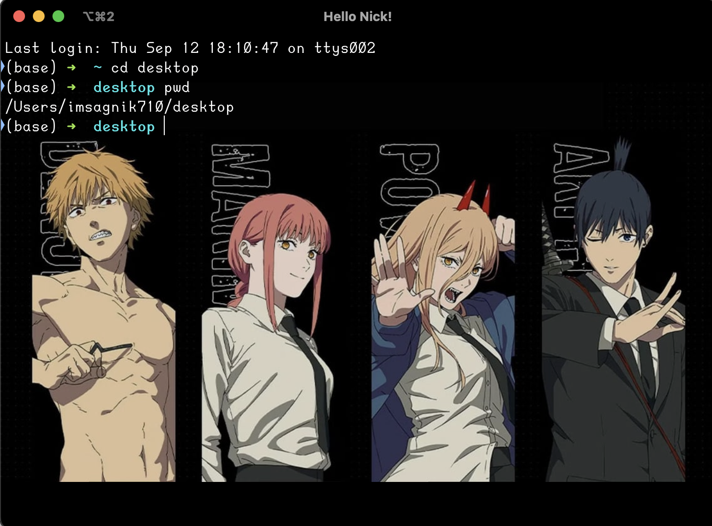

- **`ls`**: List Directory Contents
  ```bash
  $ ls
  file1.txt  file2.txt  folder
  ```
 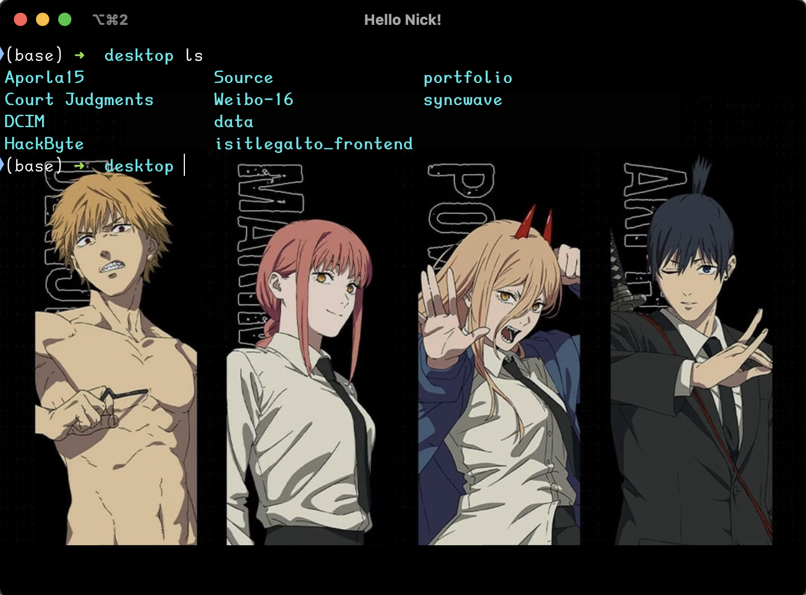

- **`cd`**: Change Directory
  ```bash
  $ cd Documents
  $ pwd
  /Users/username/Documents
  ```
 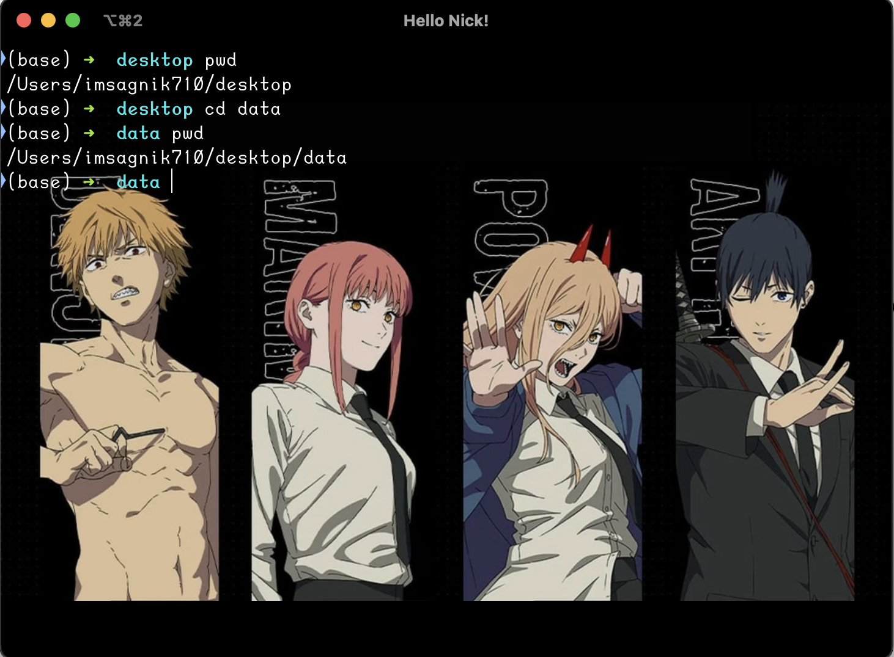

### 2.2 **File Operations**

- **`cp`**: Copy Files or Directories
  ```bash
  $ cp file1.txt file2.txt backup/
  ```
  

- **`mv`**: Move or Rename Files or Directories
  ```bash
  $ mv file1.txt file2.txt backup/
  ```
  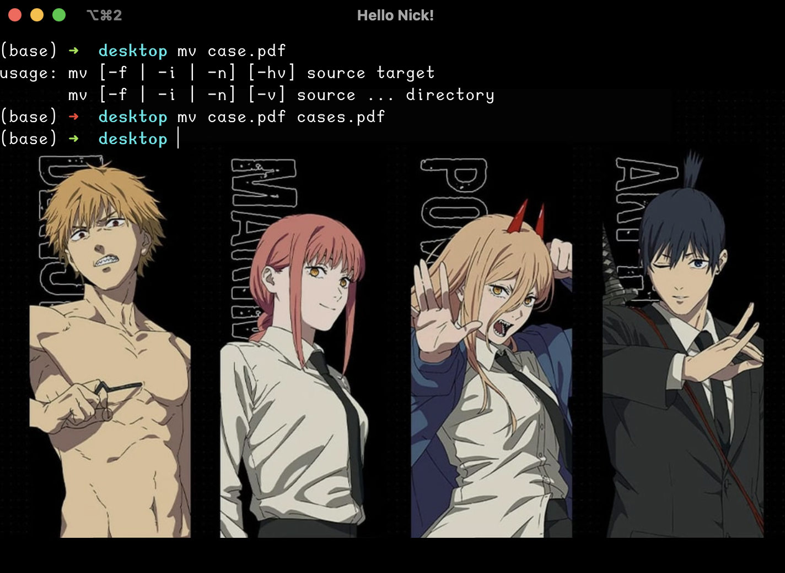

- **`rm`**: Remove Files or Directories
  ```bash
  $ rm file1.txt
  ```
 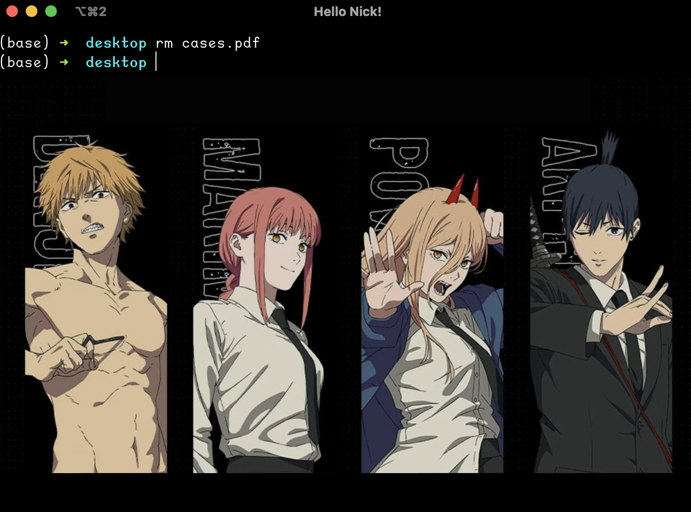

### 2.3 **Viewing File Content**

- **`cat`**: Concatenate and Display File Content
  ```bash
  $ cat file1.txt
  ```
  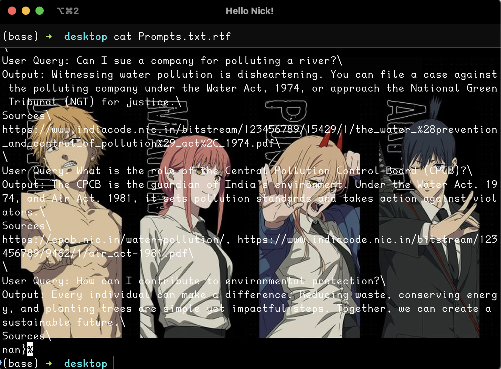

- **`less`**: View File Content One Page at a Time
  ```bash
  $ less file1.txt
  ```
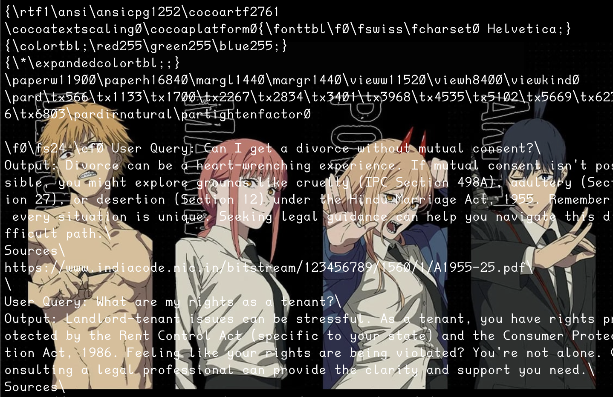

- **`grep`**: Search for Patterns in Files
  ```bash
  $ grep "search_term" file1.txt
  ```
  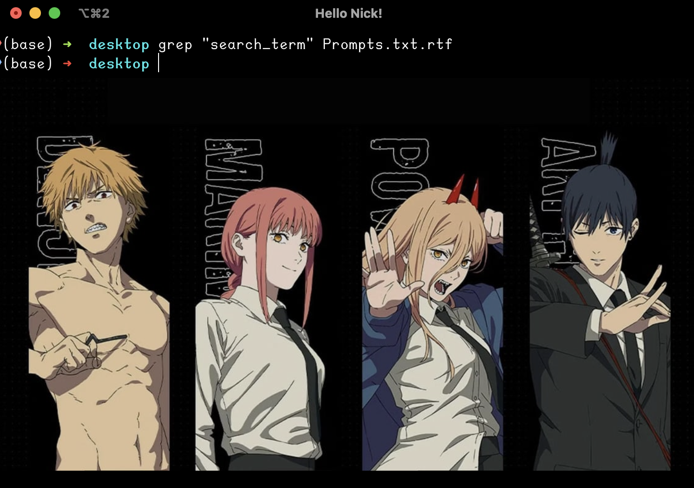

## 3. **Managing Processes**

- **`ps`**: Display Information About Running Processes
  ```bash
  $ ps aux
  ```
  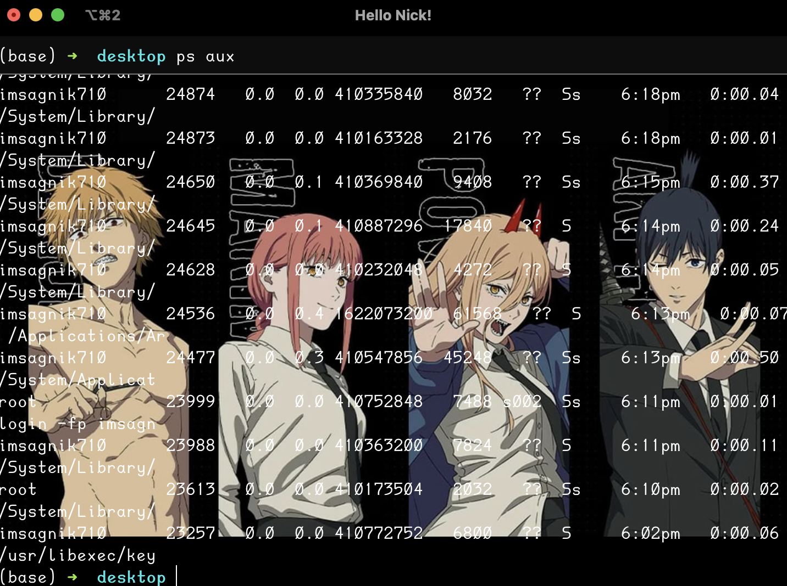

- **`top`**: Display a Dynamic View of System Processes
  ```bash
  $ top
  ```
  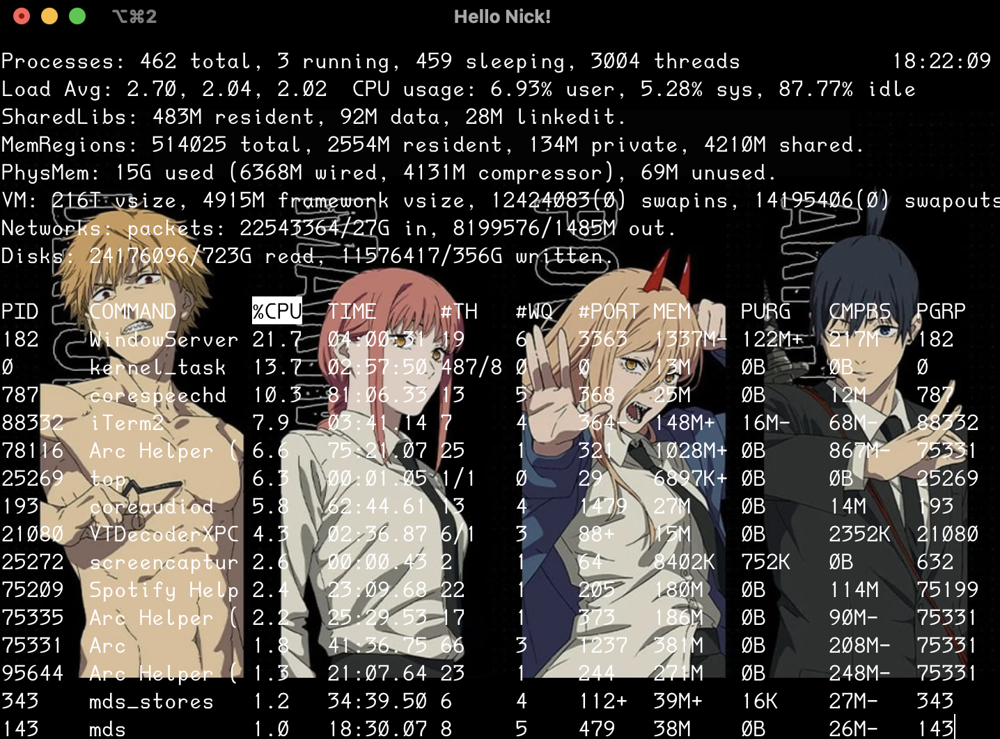

- **`kill`**: Terminate Processes
  ```bash
  $ kill 1234
  ```

## 4. **Permissions and Ownership**

- **`chmod`**: Change File Permissions
  ```bash
  $ chmod 755 file1.txt
  ```

- **`chown`**: Change File Owner and Group
  ```bash
  $ chown user:group file1.txt
  ```

## 5. **Creating and Managing Archives**

- **`tar`**: Archive Files
  ```bash
  $ tar -cvf archive.tar file1.txt file2.txt
  ```

- **`zip`**: Compress Files into a ZIP Archive
  ```bash
  $ zip archive.zip file1.txt file2.txt
  ```


## 6. **Useful Resources**

### 6.1 **YouTube Tutorials**

- [Learn Linux Command Line Basics](https://www.youtube.com/watch?v=6w8nZ_2dQd8)
- [Introduction to Command Line Interface](https://www.youtube.com/watch?v=V0wy8p6S7DU)
- [CLI Basics for Beginners](https://www.youtube.com/watch?v=8h9s7rA4p2s)

### 6.2 **GitHub Repositories**

- [CLI Basics - Examples and Tutorials](https://github.com/cli-basics/examples)
- [Awesome CLI Tools](https://github.com/cheat/cheat) - A collection of command line tools and tips.


### 6.3 **Articles and Guides**

- [The Ultimate Guide to Command Line Basics](https://www.makeuseof.com/tag/command-line-basics/)
- [Command Line Crash Course](https://learnpythonthehardway.org/book/appendixa.html)


## 7. **Demo: Creating and Listing Files**

```bash
# Create a directory
$ mkdir demo_directory

# Change into the directory
$ cd demo_directory

# Create a file
$ touch demo_file.txt

# List files
$ ls
demo_file.txt
```

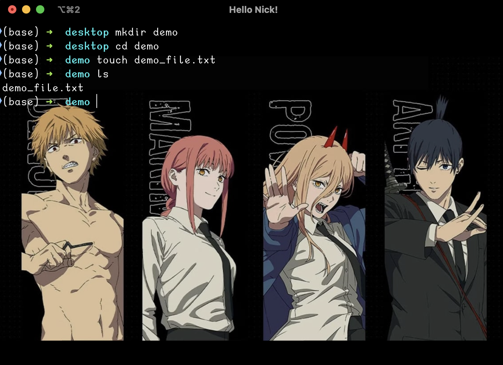

---

With these basics, you're well on your way to becoming proficient with the CLI. As you continue to use these commands, you'll discover even more powerful ways to interact with your system.

Happy coding!

---