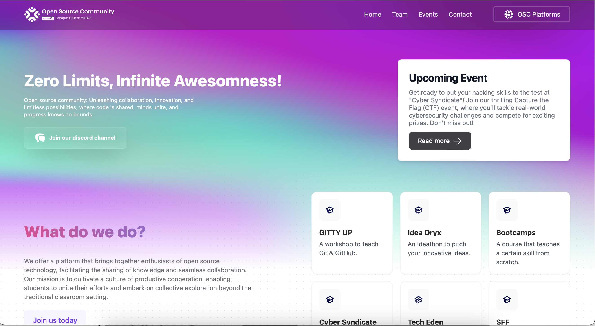

Open sourcing your projects can offer numerous benefits beyond just contributing to the community. It allows you to gain visibility, collaborate with others, and enhance the quality of your work. Here's why you should consider open sourcing your projects.

## 1. **Benefits of Open Sourcing**

### 1.1 **Community Collaboration**

Open sourcing allows you to collaborate with developers around the world. Contributions from diverse perspectives can help you improve your project more quickly and effectively.

**Example:**
- **[Homebrew](https://github.com/Homebrew/homebrew-core)** is a popular open source package manager for macOS that thrives due to its vibrant community of contributors.

### 1.2 **Increased Visibility**

An open source project can gain more visibility, which can lead to new opportunities such as job offers, speaking engagements, or partnerships.

**Example:**
- **[TensorFlow](https://github.com/tensorflow/tensorflow)**, an open source machine learning framework by Google, has gained immense visibility and contributed to numerous research and commercial applications.

### 1.3 **Skill Development**

Maintaining an open source project helps you develop valuable skills, including coding, project management, and collaboration. It can also be a great addition to your portfolio.

**Example:**
- **[React](https://github.com/facebook/react)**, maintained by Facebook, is an excellent example of how contributing to a major project can significantly boost your skills and career.

### 1.4 **Quality Improvement**

Open source projects benefit from code reviews and feedback from the community, leading to better software quality and fewer bugs.

**Example:**
- **[Linux](https://github.com/torvalds/linux)**, the open source operating system kernel, has become highly reliable and feature-rich thanks to contributions from thousands of developers.

### 1.5 **Learning and Teaching**

Open source provides an opportunity to learn from others and teach others by sharing your own knowledge.

**Example:**
- **[Mozilla Firefox](https://github.com/mozilla/gecko-dev)** is a great example where contributors not only learn from the codebase but also improve their skills by collaborating on an established project.

## 2. **How to Open Source Your Project**

### 2.1 **Choose a License**

Select an appropriate open source license for your project. Common licenses include:

- **MIT License**: Simple and permissive.
- **GPL License**: Ensures derivative works are also open source.
- **Apache License**: Includes a grant of patent rights.

**Example:** [Choosing an Open Source License](https://opensource.org/licenses)

### 2.2 **Prepare Your Repository**

1. **Create a GitHub Repository**:

    ```sh
    git init
    git add .
    git commit -m "Initial commit"
    git branch -M main
    git remote add origin https://github.com/username/repository.git
    git push -u origin main
    ```

2. **Add a README File**: Provide documentation and usage instructions.

3. **Add a LICENSE File**: Include the chosen license text.

4. **Create a CONTRIBUTING.md File**: Outline how others can contribute to your project.

**Example Repository:**
- [GitHub Repository Example](https://github.com/username/repository)

### 2.3 **Promote Your Project**

Share your project on social media, relevant forums, and community platforms to attract contributors and users.

**Example:**
- Share your project on [Reddit](https://www.reddit.com/r/opensource/) or [Hacker News](https://news.ycombinator.com/).

## 3. **Resources and Tools**

### 3.1 **YouTube Tutorials**

- [How to Open Source Your Project on GitHub](https://www.youtube.com/watch?v=O_8hQo2vKzc)
- [Introduction to Open Source](https://www.youtube.com/watch?v=d3mW6d9i8uI)
- [Managing Open Source Contributions](https://www.youtube.com/watch?v=VjXEGQ2fj5g)

### 3.2 **GitHub Repositories**

- [Awesome Open Source](https://github.com/sindresorhus/awesome) - A curated list of awesome open source projects.
- [Open Source Guides](https://github.com/open-source-guides) - Guides for maintaining and contributing to open source projects.

### 3.3 **Articles and Guides**

- [Why Open Source?](https://opensource.com/resources/what-open-source) - A comprehensive guide on the advantages of open source.
- [How to Open Source Your Project](https://opensource.com/article/19/11/how-open-source-your-project) - Detailed instructions on open sourcing your project.

## 4. **Demo**

Here's an example of a simple open source project:



You can view the demo project [here](https://github.com/osc-vitap/OSC-Web).

---

By open sourcing your projects, you not only contribute to the community but also enhance your own skills and career opportunities. Happy coding!


