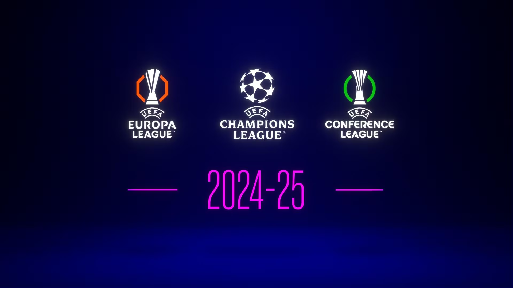

UEFA Champions League 2024: New Format Overview

UEFA is revamping the Champions League format from 2024 to make it even more exciting. This change will impact how teams qualify and advance through the tournament. Today, we'll break down the new format and what it means for football fans and teams alike.

The new format is designed to enhance competitiveness and give more teams a shot at progressing to the knockout stages. The core change involves the league stage being expanded and the introduction of new stages in the knockout rounds.

Key Changes

1. Expanded Group Stage
The group stage will now feature 36 teams instead of the previous 32. Each team will play 8 matches in a round-robin format against different opponents, rather than the traditional home-and-away matches.

2. Introduction of the Swiss Model
The new Swiss model means teams are not fixed in groups but are instead placed in a large pool, where they play a set number of matches against various teams. This increases the number of competitive games each team plays.

3. Top 8 Teams Automatically Advance
The top 8 teams from the Swiss stage will automatically progress to the Round of 16, while teams ranked 9-24 will enter a new knockout round called the "Playoff Round" to secure their place in the Round of 16.

4. Enhanced Qualification Opportunities
The new format allows for more teams from different leagues to qualify for the tournament, promoting a more diverse competition.

In summary, the revamped Champions League format will offer more matches, increased competitiveness, and new opportunities for teams to showcase their skills on Europe’s biggest stage.

For more details, check the official UEFA announcement.
